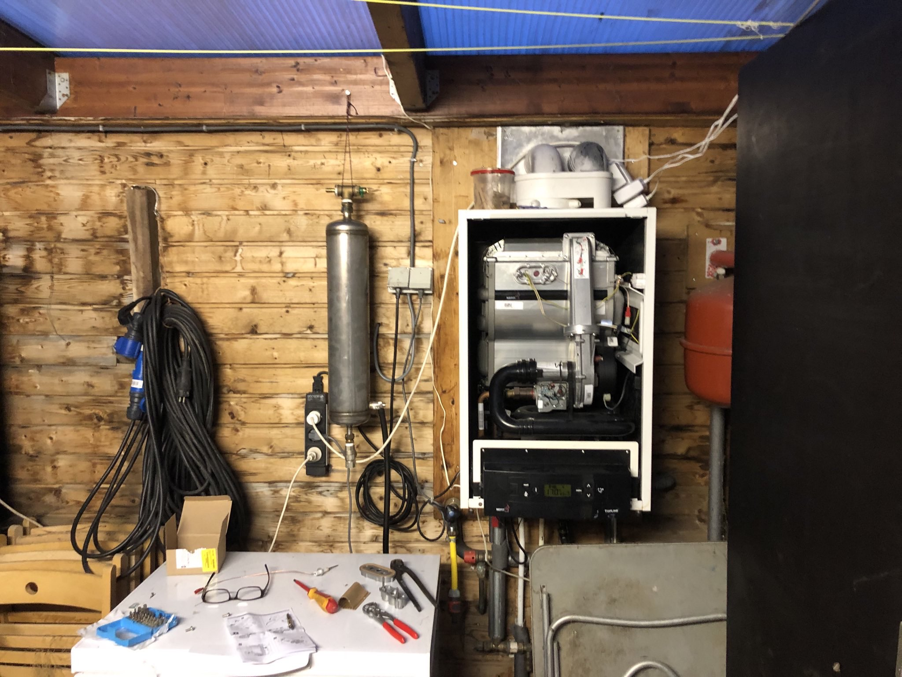

## Nieuw deurrelais wasmachine

17-10-2924 Amsterdam

Contactje had ik al vele malen opgepoetst en pomp ook al eens vervangen, nu een [nieuw deurslot](https://www.mijnonderdelenhuis.nl/aeg-aeg-deurrelais-1105771024-54742211.html) erin voor nog geen 30 euro. Hij gaat wel meteen marktplaats op, want ben een beetje klaar met deze machine. Hij heeft het overigens praat 21 jaar gedaan, dus ik klaag niet. 

De volgende wordt een Miele profi@work200 (van marktplaats uiteraard)

## Peiker zendmicrofoon

12-10-2024 Amsterdam

Om de Brandweerbus helemaal compleet te maken wil ik de mic van de VHF vervangen met een [originele Peiker uit die tijd](https://www.pa3eki.nl/condor3000/mic2.jpg), op Marktplaats voor een tientje gevonden, met-zonder snoer.

## David Clark GroundControl Headset

10-12-2024 Amsterdam

Ik ben niet zo dol op dingen met batterijen/accu's. Die zijn vaak leeg als dat je net niet uitkomt. maar vooral als je zolang met je spullen doet als ik dan zit je gedurende de levensduur van zo'n apparaat 1 of 2 keer er een nieuwe accu voor ze zoeken om die er in te solderen en daar ben je zo een halve dag mee bezig. En .... schaarse grondstof waarvan recycling nog in de kinderschoenen staat.

Dus niets Bose noise canceling enzo, gewoon ouderwetse GroundControl headset voor in de trein en kantoortuin. Ongebruikt, nieuw in doos voor een habbekrats, alleen wel een plug waar je zonder vliegtuig bijzonder weinig mee kan en een 50 Ohm microfoon. Dus toch nog een beetje klussen vandaag.

## Sailor RT144 op VHF 31 walstation

07-10-2024 Oostmahorn

Voor de jachthaven hier een oude Sailor RT144 marifoon op de kopgetikt zodat zij door passanten  op kanaal 31 kunnen worden aangeroepen. Hadden ze zelf ook al geprobeert maar ze hadden niet bedacht dat kanaal 31 een duplex kanaal is en dat je dus moet zend op wat voor schepen de ontvangst frequentie is (beetje ombouwen dus). Meteen 2 gedaan, heb er nu zelf ook eentje aan de muur hier.

## Mistlicht bedrading

23-08-2024 Oostmahorn

Het is welliswaar niet verplicht op mijn old-timer, mistachterlicht. Maar die schroeven ze tegenwoordig niet voor niets op auto's. Dus alvorens er een nietsvermoedende vrachtwagenchauffeur bij mij naar binnen rijd daar de bedrading voor aangelegd. Op [motor-talk.de](https://www.motor-talk.de) kon iemand mij haarfijn uitleggen hoe ik dat moest aanpakken. 

## Pierburg Anreicherungsventil 

23-08-2024 Oostmahorn

Na dat de Garage het had opgegeven en ik de [Haynes Carburator-Bijbel](https://haynes.com/en-gb/haynes-manual-carburettors) had doorgespit ben ik oude instructie [video's voor monteurs uit de jaren 80](https://www.youtube.com/watch?v=mKS-5ti1fPg) gaan bekijken. ik kreeg overigens knallende koppijn van dat slechte beeld. Op het einde van de laatste video werd, tussen neus en lippen door, precies de klachten die ik met mijn motor had beschreven en mij bezworen dat ik dan niet aan alles moest gaan draaien. wat ik en de garagist natuurlijk wel al hadden gedaan. 

Na enig zoeken kwam ik uit bij [vergaserteile.de](https://www.vergaserteile.de/p/anreicherungsventil-pierburg-z-b-1b-2b-2e-vergaser)  alwaar ik voor nog geen 30 euro een nieuw "Anreicherungsventil" kon bestellen. Op de ochtend dat het aankwam heb ik nog in mijn pyama, blij als eenkind, het nieuwe ventiel erin geschroefd en ... motortje bromde vanaf toen als een blije libelle.

## Mag niet, maar wel goed idee

22-08-2024 Oostmahorn

Je mag geen ledverlichting gebruiken in een oldtimer, en ik heb ondertussen ook uitgevonden waarom. Maar het is wel een goed idee, want het electrisch systeem van die auto is niet gemaakt om overdag (en dus altijd) met de lichten aan te rijden (er zit maar een 30 A dynamo in) .

Maar de kappen en reflectoren zijn er niet op gemaakt dus je krijgt te puntig en te fel licht als je het moderne ledlampen er in draait. Dus die moesten op maat worden gemaakt. Ook het [knipperrelais](https://www.techniekwebshop.nl/c/?query=Knipperrelais+LED+Hella) moest ik vervangen.

## Op de brug
21-08-2924 Dokkum

Bij de kwik-fit in dokkum heb ik 4 nieuwe banden (smaller en stiller) onder de bus laten zetten. De oude kregen al eieren in de flanken en ik had geen zin om langs de autobahn uit te vnden dat die bouten niet los te krijgen zijn. Dat was namelijk inderdaad het geval, de slagsleutel van Kwikfit kreeg ze niet los. 

Wat vooral aardig was dat ze de bus al voor de lunch op de brug hebben gezet zodat ik rustig 45mins mijn nieuwe aanwinst kon inspecteren. Dat viel niet tegen: Als nieuw !

## Espagnolet "Bruinen" met Salpeterzuur

20-08-2024 Oostmahorn
De espagnolet van de achterdeuren was een van de weinige onderdelen waar de coating aangetast was door putroest, dus die heb ik kaalgehaald en mooi glas geschuurd. Maar wat daarna ? Verven wordt niet mooi en is te kwetsbaar, verchromen of galvaniseren te omslachtig. 

Dus koos ik voor "zwarten" zoals ze met geweren doen. Ik belde naar [elspeet](https://geweermakerij.n) waar ze me geduldig uitlegden hoe, wat, dat het bruinen heet en hoe ik aan de [benodige spullen](ballistol-shop.nl) kon komen. Ik heb het om veiligheidsreden maar in de dousche gedaan.

## Carrosserie opgeknapt
17-08-2024 Oostmahorn

In de Zomervakantie die ik ook dit jaar weer in Oostmahorn doorbracht heb ik elke dag een paar uurtjes geklust en en een uurtje online spulletjes gezocht. Zoals (legale) oranje kappen, mistachterlicht, autoradio uit jaren 80, maar ook lampjes, schakelaartjes, speciaal Mercedes gereedschap voor de motor enz enz. 

Na het uitbreken van het brandweer-interieur alle roestplekken kaal gehaald met de staalborstel (maar even een nieuwe haakse slijper gekocht want op een of andere manier valt het gereedschap van Douwe allemaal precies uit elkaar als ik het in mijn handen heb). Vloer helemal vetvrij gemaakt en in de [Brandweerrode Owatrol](https://www.owatrol.nl/product/rustol-deco-owatrol-op-kleur/) gezet. Alle plekjes rondom ook gedaan hij staat namelijk voortaan buiten.

En ook nog even de auto omgekat naar een volwaardige personenauto, vandaar het nieuwe kenteken

## Spulletjes oud en nieuw bewaren

17-08-2024 Oostmahorn

Dit wordt een project van de lange adem dus moet ik alles wat ooit weer terug de bus in moet netjes opbergen. Meestal moet ik van mijn eigen fouten leren maar in dit geval kon ik leren van de [fouten van mijn vader](reparaties.assets/aurelia.jpg).

## Optische SPdif en nieuwe rubbers

06-08-2024 Amsterdam

de DDS-en kunnen weer 30 jaar mee ! Blijft het mooiste (betaalbare) digtiale geluid

## Wasmachine van de kringloop

03-05-2024 Oostmahorn

Bij de kringloop een "nieuwe" wasmachine gehaald, slaat de aardlek er meteen uit bij mij thuis. Nu eigenlijk ... helemaal niet meteen, pas na vullen met water en na drie rondjes draaien. Dus hoogst waarschijnlijk het verwarmingselement. Nieuw besteld bij miele en ook meteen het [monteurs handboek](https://www4.miele.de/msd?vg=VG-NL&country=NL&language=nl ) bij ze opgevraagd. Hij doet het weer als nieuw.

## 2e hands Modelvliegtuigje

23-04-2024 Oostmahorn

Gekocht via marktplaats en door Douwe en Felix in het zuiden van het land opgehaald. Een mooie grote zwever voor mijn autonomeous flight experimenten met [ardupilot](https://ardupilot.org). Hele berg sensoren gekocht (allemaal uit China, dat dan weer wel) die we er vrolijk op gaan plakken. Ook nog even mijn [Drone-Vliegbewijs](https://www.rdw.nl/particulier/voertuigen/drone/het-vliegbewijs-en-het-exploitantnummer-van-een-drone/aanvragen) gehaald (tip van de [beheerder van de Marnewaard](https://www.np-lauwersmeer.nl/hoe-kom-er/militaire-oefeningen/))

## Tesla-Machine proof codeslot

31-03-2024 Amsterdam

Mijn electronisch deurslot (op basis van een arduino-uno) bleek (net als de meeste electronische sloten die je in de winkel kan kopen) niet bestand tegen mijn eigen Mini EMP generator (Taser met spoel). De oplossing lag er uiteindelijk de pulldown weerstand en de retourstroom diode echt bovenop de transistor te solderen. Nu niet meer hackbaar en wel vrolijk zonder sleutels de deur uit.

## Nieuw accu in de autosleutel

16-02-2024      

Op zoek naar een list voor de lege batterij van m’n autosleutel  vond ik vele instructables met daarbij de klacht dat deze niet zonder  breek- en soldeerwerk te vervangen is. Meestal met daarbij een  beschuldiging van geldklopperij. Nieuwe sleutel is inderdaad niet  gratis, maar een nieuwe auto aanmerkelijk duurder,

Na 14 jaar laadde bij mij ėėn van de autosleutels niet meer op (het  is een accuutje); Ruim voorbij de gemiddelde levensduur van een auto. En 14 jaar is de batterij er níét door nieuwsgierige vingers uitgepeuterd. Prima dus !

Maar nu is hij op en ik wil daar wat aan doen. Als je een oester kan openmaken dan lukt dit. Ook hier doek gebruiken om [SEH](https://www.olvg.nl/afdelingen/spoedeisende-hulp/)bezoek te voorkomen. Youtube-willy-wortels raadden mij aan om [op ebay de versie](https://www.ebay.com/sch/i.html?_nkw=vl2020+panasonic+bmw) te bestellen met de pootjes op precies de goede plek. Dat deze alleen  nog maar op ebay is te vinden komt omdat hij niet meer gemaakt wordt. Je bent dan met veel liefde en toewijding een stokoude batterij in je  sleutel aan het knutselen.

Ik kocht een [VL2020 met pootjes](https://nl.rs-online.com/web/p/button-rechargeable-batteries/6690514) die nog wel gemaakt wordt voor 6 euro en soldeerde er een draadje aan.

## Nefit Ketel Kaduuk

01-02-2024 Oostmahorn

Mijn huisje aan het Lauwersmeer kwam met een NEFIT ketel, een volstrek overengineered ding met meer bewegende onderdelen dan een draaiorgel. Ik wil sowiso van dat ding af maar hij gaat nu net iets te vroeg kapot. Hij gaat na 5 seconden branden in storing (heeft dus niet door dat ie brand en skuit het gas af) . Bij WarmteService snel een nieuwe ionensensor gehaald en er in gezet (maar 1 nacht in de kou)

## Home automation slurpt stroom

04-11-2023

De bedoeling was nu juist dat we met in gebouwde slimmigheid minder stroom en gas gingen gebruiken, ik ben tenslotte vrijwel nooit thuis. Maar als er vevogens een computer dag en nacht aanstaat om dat te regelen is de operatie welliswaar geslaagd maar de patient wel overleden.

Dus vandaag alle scriptjes op energie zuinige siemens doosjes geprogrammeerd en aangesloten

Als nu de [mannetjes met USB sticks](https://en.wikipedia.org/wiki/Stuxnet) een beetje uit de buurt blijven gaat alles goed hier
