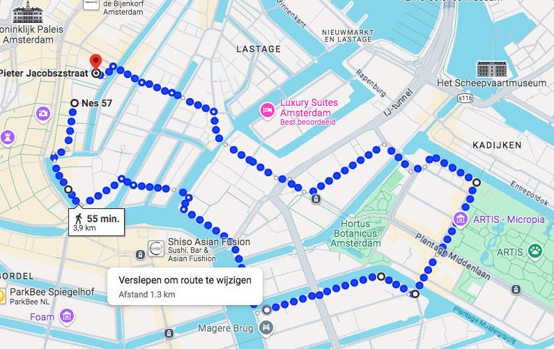
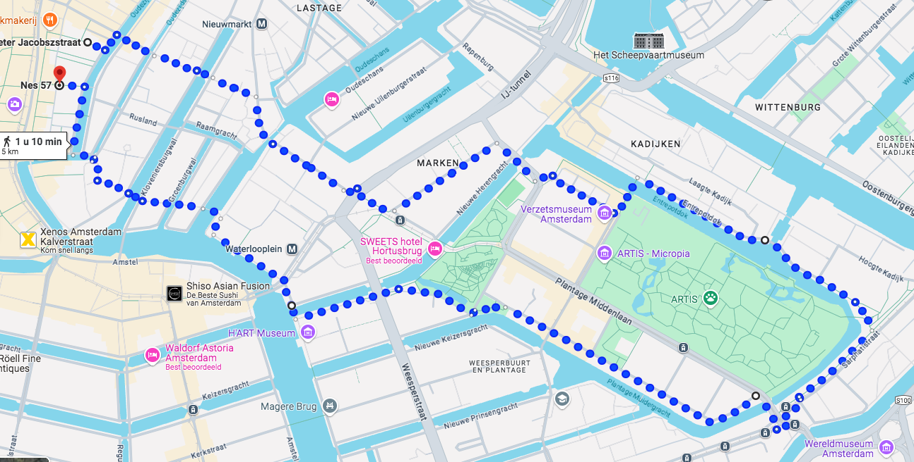

## Week 1 van 6

#### MAANDAG: 

| Nulmeting     |                                                              |
| ------------- | ------------------------------------------------------------ |
| Rekoefeningen | Hak-Bil, Huppel-Armzwaai, SchopHand 10x Pas-Knie-op-de-Grond 10x V-stand en buigen, Kniebuigingen 10x |
| Warming-up    | Inlopen tot Lommertbrug                                      |
| Coopertest    | 12 min zoveel mogelijk meters lopen richting Uilenburgerstraat |
| Cooling-down  | 5 min teruglopen (duurloop 1) met statische rekoefeningen    |

NB: duurloop 1 = Stevig doorlopen (6km/u),  Duurloop 2 = Joggen, Duurloop 3 = Hardlopen (13km/h)

#### DINSDAG: 

| Rompstabiliteit   |                                            |
| ----------------- | ------------------------------------------ |
| Voorwaartse plank | 2x2 10 sec - rust 60 sec                   |
| Zijwaartse plank  | 2x2 10 sec - rust 60 sec (links en rechts) |
| Brug              | 2x2 10 sec - rust 60 sec                   |

| Tilllen en dragen      |                                                              |
| ---------------------- | ------------------------------------------------------------ |
| Squat met dumbells     | 5x 3 kilo per hand - rust 30 sec 5x 4 kilo per hand - rust 30 sec 5x 5 kilo per hand  - rust 30 sec |
| Gewicht naar heupen    | 5x 3 kilo per hand - rust 30 sec 5x 4 kilo per hand - rust 30 sec 5x 5 kilo per hand  - rust 30 sec |
| Gewicht omhoog + tenen | 5x 3 kilo per hand - rust 30 sec 5x 4 kilo per hand  - rust 30 sec 5x 5 kilo per hand  - rust 30 sec |
| Full exercise          | Dumbell van grond naar heuphoogte Loop 25 meter (met het gewicht op heuphoogte Till Dumbell naar iets boven het hoofd, en op de tenen (5 herhalingen met 5 kilo per hand) |

#### WOENSDAG = Rustdag

#### DONDERDAG

| Extensieve duurloop |                                                              |
| ------------------- | ------------------------------------------------------------ |
| Rekoefeningen       | Hak-Bil, Huppel-Armzwaai, SchopHand 3 x 20 Pas-Knie-op-de-Grond 10x V-stand en buigen, Kniebuigingen samen 10x |
| Warming-up          | Inlopen tot Lommertbrug                                      |
| Kern                | 600 meter in 6 m => Lommertbrug tot Sint AntonieSluis 2 min rustig wandelen => tot ir. B. Bijvoetbrug 600 meter in 6 m => Lommertbrug |
| Cooling-down        | Uitlopen met statische rekoefeningen                         |

NB: Duurloop 2 betekent joggen in een tempo dat je nog steeds goed kan praten

#### VRIJDAG

| Mars             |                                                      |
| ---------------- | ---------------------------------------------------- |
| Mars 4 kilometer | 6 km/u op hoge wandelschoenen en (warm) trainingspak |

| Sportschool: Rompstabiliteit |                                            |
| ---------------------------- | ------------------------------------------ |
| Voorwaartse plank            | 2x2 10 sec - rust 60 sec                   |
| Zijwaartse plank             | 2x2 10 sec - rust 60 sec (links en rechts) |
| Brug                         | 2x2 10 sec - rust 60 sec                   |

| Sportschool: Tilllen en dragen               |                                                              |
| -------------------------------------------- | ------------------------------------------------------------ |
| Squat met dumbells                           | 5x 3 kilo per hand - rust 30 sec 5x 4 kilo per hand - rust 30 sec 5x 5 kilo per hand - rust 30 sec |
| Gewicht naar heupen                          | 5x 3 kilo per hand - rust 30 sec 5x 4 kilo per hand - rust 30 sec 5x 5 kilo per hand - rust 30 sec |
| Gewicht boven hoofd  + op de tenen staan | 5x 3 kilo per hand - rust 30 sec 5x 4 kilo per hand - rust 30 sec 5x 5 kilo per hand - rust 30 sec |

## Week 2 van 6

#### MAANDAG: 

| Extensieve duurloop |                                                              |
| ------------------- | ------------------------------------------------------------ |
| Rekoefeningen       | Hak-Bil, Huppel-Armzwaai, SchopHand 3 x 20 Pas-KnieopdeGrond 20x V-stand en buigen, Kniebuigingen samen |
| Warming-up          | 5 min inlopen naar de Lommertbrug                            |
| Coopertest          | 1km in 8 min => Lommertbrug om Stopera tot Waterlooplein 2 min rustig wandelen => tot Mozes en Aaronkerk 800 meter in 6 m => tot Prinsenhofsteeg (proeflokaal) |
| Cooling-down        | 5 min uitlopen met statische rekoefeningen                   |

#### DINSDAG: 

| Rompstabiliteit   |                                                 |
| ----------------- | ----------------------------------------------- |
| Voorwaartse plank | 2x2 10 sec - rust 60 - 90 sec                   |
| Zijwaartse plank  | 2x2 10 sec - rust 60 - 90 sec (links en rechts) |
| Brug              | 2x2 10 sec - rust 60 - 90 sec                   |

| Tilllen en dragen      |                                                              |
| ---------------------- | ------------------------------------------------------------ |
| Squat met dumbells     | 10x 3 kilo per hand - rust 30 sec 10x 4 kilo per hand - rust 30 sec 10x 5 kilo per hand - rust 30 sec |
| Gewicht naar heupen    | 10x 3 kilo per hand - rust 30 sec 10x 4 kilo per hand - rust 30 sec 10x 5 kilo per hand - rust 30 sec |
| Gewicht omhoog + tenen | 10x 3 kilo per hand - rust 30 sec 10x 4 kilo per hand - rust 30 sec 10x 5 kilo per hand - rust 30 sec |
| Full exercise          | Dumbell van grond naar heuphoogte Loop 25 meter (met het gewicht op heuphoogte Till Dumbell naar iets boven het hoofd, en op de tenen (10 herhalingen met 5 kilo per hand) |

#### WOENSDAG: 

| Zwemmen    | 500 meter                                                    |
| ---------- | ------------------------------------------------------------ |
| Warming-Up | 4 x 25 m zwemmen, slag naar keuze (30 sec rust tussen elke baan) |
| Oefening 1 | 200 m zwemmen, slag naar keuze (zonder pauze)                |
| Oefening 2 | 2 x 8 m onder water zwemmen (lichaam volledig onder water)   |
| Oefening 3 | Zwem achtereenvolgens de volgende afstanden (slag naar keuze) en neem na iedere afstand 20 sec rust: 25 m - 50 m - 75 m - 50 m - 25 m |
| Cool-Down  | 50 m zwemmen, slag naar keuze                                |

Zuiderbad banenzwemmen 

- Dinsdag van 15:30 tot 22:00
- Woensdag 07:00 - 09:00 en 12:00 - 16:00 en 18:45 - 22:00

| Los kaartje (van­af 3 jaar)                     | € 6,00  |
| ----------------------------------------------- | ------- |
| Los kaartje met Stads­pas (groe­ne stip)        | € 1,00  |
| 12-ba­den­kaart 3 jaar en ou­der (10 x € 6,00)* | € 60,00 |

#### DONDERDAG:

| Extensieve interval | Op de loopband                                               |
| ------------------- | ------------------------------------------------------------ |
| Rekoefeningen       | Hak-Bil, Huppel-Armzwaai, SchopHand 3 x 20 Pas-KnieopdeGrond 20x V-stand en buigen, Kniebuigingen samen |
| Warming-up          | 5 min inlopen (duurloop 1)                                   |
| Kern                | Extensieve interval, op tempo van de 12 minutenloop of iets sneller • 3 maal (2 min hard - 2 min rust) - 3 min pauze wandel/dribbel • 4 maal (1 min hard - 1 min rust) - 3 min pauze wandel/dribbel • 6 maal (30 sec hard - 30 sec rust) |
| Cooling-down        | 5 min uitlopen (duurloop 1) met statische rekoefeningen      |

#### VRIJDAG

| Mars             |                                                      |
| ---------------- | ---------------------------------------------------- |
| Mars 5 kilometer | 6 km/u op hoge wandelschoenen en (warm) trainingspak |

| Rompstabiliteit   |                                                              |
| ----------------- | ------------------------------------------------------------ |
| Voorwaartse plank | 2 series van 2 x 10 sec - rust 60 - 90 sec                   |
| Zijwaartse plank  | 2 series van 2 x 10 sec - rust 60 - 90 sec (links en rechts) |
| Brug              | 2 series van 2 x 10 sec - rust 60 - 90 sec                   |

| Tilllen en dragen                            |                                                              |
| -------------------------------------------- | ------------------------------------------------------------ |
| Squat met dumbells                           | 10x 4 kilo per hand - rust 30 sec 10x 5 kilo per hand - rust 30 sec 10x 6 kilo per hand - rust 30 sec |
| Gewicht naar heupen                          | 10x 4 kilo per hand - rust 30 sec 10x 5 kilo per hand - rust 30 sec 10x 6 kilo per hand - rust 30 sec |
| Gewicht boven hoofd  + op de tenen staan | 10x 4 kilo per hand - rust 30 sec 10x 5 kilo per hand - rust 30 sec 10x 6 kilo per hand - rust 30 sec |

## Week 3 van 6

#### MAANDAG: 

| Extensieve duurloop |                                                              |
| ------------------- | ------------------------------------------------------------ |
| Rekoefeningen       | Hak-Bil, Huppel-Armzwaai, SchopHand 3 x 20 Pas-KnieopdeGrond 20x V-stand en buigen, Kniebuigingen samen |
| Warming-up          | 5 min inlopen naar de Lommertbrug                            |
| Kern                | 1200 m in 10 min => Lommertbrug, Vas Diaz Monument 2 min rustig wandelen => Jonas Daniel Meijerplein 1000 meter in 8 m => tot Lommertbrug |
| Cooling-down        | 5 min uitlopen (duurloop 1) met statische rekoefeningen      |

#### DINSDAG: 

| Rompstabiliteit   |                                                              |
| ----------------- | ------------------------------------------------------------ |
| Voorwaartse plank | 2 series van 2 x 10 sec - rust 60 - 90 sec                   |
| Zijwaartse plank  | 2 series van 2 x 10 sec - rust 60 - 90 sec (links en rechts) |
| Brug              | 2 series van 2 x 10 sec - rust 60 - 90 sec                   |

| Tilllen en dragen      |                                                              |
| ---------------------- | ------------------------------------------------------------ |
| Squat met dumbells     | 5 kilo per hand (10x) - rust 30 sec 6 kilo per hand (10x) - rust 30 sec 7 kilo per hand (10x) - rust 30 sec |
| Gewicht naar heupen    | 5 kilo per hand (10x) - rust 30 sec 6 kilo per hand (10x) - rust 30 sec 7 kilo per hand (10x) - rust 30 sec |
| Gewicht omhoog + tenen | 5 kilo per hand (10x) - rust 30 sec 6 kilo per hand (10x) - rust 30 sec 7 kilo per hand (10x) - rust 30 sec |
| Full exercise          | Dumbell van grond naar heuphoogte Loop 25 meter (met het gewicht op heuphoogte Till Dumbell naar iets boven het hoofd, en op de tenen (10 herhalingen met 7 kilo per hand) |

#### WOENSDAG = Rustdag

#### DONDERDAG:

| Extensieve interval |                                                              |
| ------------------- | ------------------------------------------------------------ |
| Rekoefeningen       | Hak-Bil, Huppel-Armzwaai, SchopHand 3 x 20 Pas-KnieopdeGrond 20x V-stand en buigen, Kniebuigingen samen |
| Warming-up          | 10 min inlopen (duurloop 1)                                  |
| Kern                | Extensieve interval, op tempo van de 12 minutenloop of iets sneller • 3 maal (2 min hard - 2 min rust) - 3 min pauze wandel • 3 maal (1 min hard - 1 min rust) - 3 min pauze wandel • 4 maal (45 sec. hard - 45 sec. rust) - 3 min pauze wandel • 4 maal (30 sec hard - 30 sec rust) |
| Cooling-down        | 5 min uitlopen (duurloop 1) met statische rekoefeningen      |

#### VRIJDAG

| Mars             |                                                              |
| ---------------- | ------------------------------------------------------------ |
| Mars 5 kilometer | 6 km/u op hoge wandelschoenen en (warm) trainingspak, rugzak 10 kg |

| Rompstabiliteit   |                                                              |
| ----------------- | ------------------------------------------------------------ |
| Voorwaartse plank | 2 series van 2 x 10 sec - rust 60 - 90 sec                   |
| Zijwaartse plank  | 2 series van 2 x 10 sec - rust 60 - 90 sec (links en rechts) |
| Brug              | 2 series van 2 x 10 sec - rust 60 - 90 sec                   |

| Tilllen en dragen      |                                                              |
| ---------------------- | ------------------------------------------------------------ |
| Squat met dumbells     | 5 kilo per hand (10x) - rust 30 sec 6 kilo per hand (10x) - rust 30 sec 7 kilo per hand (10x) - rust 30 sec |
| Gewicht naar heupen    | 5 kilo per hand (10x) - rust 30 sec 6 kilo per hand (10x) - rust 30 sec 7 kilo per hand (10x) - rust 30 sec |
| Gewicht omhoog + tenen | 5 kilo per hand (10x) - rust 30 sec 6 kilo per hand (10x) - rust 30 sec 7 kilo per hand (10x) - rust 30 sec |
| Full exercise          | Dumbell van grond naar heuphoogte Loop 25 meter (met het gewicht op heuphoogte Till Dumbell naar iets boven het hoofd, en op de tenen (10 herhalingen met 7 kilo per hand) |

## Week 4 van 6

#### MAANDAG: 

| Extensieve duurloop |                                                              |
| ------------------- | ------------------------------------------------------------ |
| Rekoefeningen       | Hak-Bil, Huppel-Armzwaai, SchopHand 3 x 20 Pas-KnieopdeGrond 20x V-stand en buigen, Kniebuigingen samen |
| Warming-up          | 5 min inlopen (duurloop 1)                                   |
| Kern                | 1 x 10 & 1 x 8 min (duurloop 2) met 2 min rustig wandelen ertussen |
| Cooling-down        | 5 min uitlopen (duurloop 1) met statische rekoefeningen      |

#### DINSDAG: 

| Rompstabiliteit   |                                                              |
| ----------------- | ------------------------------------------------------------ |
| Voorwaartse plank | 2 series van 2 x 10 sec - rust 60 - 90 sec                   |
| Zijwaartse plank  | 2 series van 2 x 10 sec - rust 60 - 90 sec (links en rechts) |
| Brug              | 2 series van 2 x 10 sec - rust 60 - 90 sec                   |

| Tilllen en dragen      |                                                              |
| ---------------------- | ------------------------------------------------------------ |
| Squat met dumbells     | 6 kilo per hand (10x) - rust 30 sec 7 kilo per hand (10x) - rust 30 sec 8 kilo per hand (10x) - rust 30 sec |
| Gewicht naar heupen    | 6 kilo per hand (10x) - rust 30 sec 7 kilo per hand (10x) - rust 30 sec 8 kilo per hand (10x) - rust 30 sec |
| Gewicht omhoog + tenen | 6 kilo per hand (10x) - rust 30 sec 7 kilo per hand (10x) - rust 30 sec 8 kilo per hand (10x) - rust 30 sec |
| Full exercise          | Dumbell van grond naar heuphoogte Loop 25 meter (met het gewicht op heuphoogte Till Dumbell naar iets boven het hoofd, en op de tenen (10 herhalingen met 8 kilo per hand) |

#### WOENSDAG: Zwemmen

| Zwemmen    |                                                              |
| ---------- | ------------------------------------------------------------ |
| Warming-Up | Zwem 2x de volgende serie en neem na 100 m 30 sec rust: 25 m borstcrawl - 25 m schoolslag - 25 m borstcrawl - 25 m schoolsla |
| Oefening 1 | Schoolslag rug zwem 4 x 25 m, neem na elke 25 m 20 sec rust Schoolslag buik zwem 4 x 25 m met een plankje, neem iedere 25 m 20 sec rust Schoolslag (armen en benen) zwem 4 x 50 m, elke 50 m 30 sec rust |
| Oefening 2 | Onder water zwemmen zo ver als je kunt (min 8 meter) tel je slagen |
| Oefening 3 | Zwem achtereenvolgens de volgende afstanden (slag naar keuze) en neem na iedere afstand 20 sec rust: 25 m - 50 m - 75 m - 50 m - 25 m |
| Cool-Down  | 50 m zwemmen, slag naar keuze                                |

#### DONDERDAG:

| Extensieve interval |                                                              |
| ------------------- | ------------------------------------------------------------ |
| Rekoefeningen       | Hak-Bil, Huppel-Armzwaai, SchopHand 3 x 20 Pas-KnieopdeGrond 20x V-stand en buigen, Kniebuigingen samen |
| Warming-up          | 10 min inlopen (duurloop 1)                                  |
| Kern                | Extensieve interval, op tempo van de 12 minutenloop of iets sneller 2 min - 3 min - 4 min - 3 min- 2 min (hard) Rust is steeds 2 minuten wandel/dribbel. |
| Cooling-down        | 5 min uitlopen (duurloop 1) met statische rekoefeningen      |

#### VRIJDAG

| Mars           |                                                              |
| -------------- | ------------------------------------------------------------ |
| 3 x 2000 meter | 5.5 km/u (= 66 sec / 100 m), wandelschoenen, trainingspak, rugzak 10 kg, rust 5 min na iedere serie |

### 

| Rompstabiliteit   |                                                              |
| ----------------- | ------------------------------------------------------------ |
| Voorwaartse plank | 3 series van 4 x 10 sec - rust 60 - 90 sec                   |
| Zijwaartse plank  | 3 series van 4 x 10 sec - rust 60 - 90 sec (links en rechts) |
| Brug              | 3 series van 4 x 10 sec - rust 60 - 90 sec                   |

| Tilllen en dragen      |                                                              |
| ---------------------- | ------------------------------------------------------------ |
| Squat met dumbells     | 6 kilo per hand (10x) - rust 30 sec 7 kilo per hand (10x) - rust 30 sec 8 kilo per hand (10x) - rust 30 sec |
| Gewicht naar heupen    | 6 kilo per hand (10x) - rust 30 sec 7 kilo per hand (10x) - rust 30 sec 8 kilo per hand (10x) - rust 30 sec |
| Gewicht omhoog + tenen | 6 kilo per hand (10x) - rust 30 sec 7 kilo per hand (10x) - rust 30 sec 8 kilo per hand (10x) - rust 30 sec |

## Week 5 van 6

#### MAANDAG: 

| Extensieve duurloop |                                                              |
| ------------------- | ------------------------------------------------------------ |
| Rekoefeningen       | Hak-Bil, Huppel-Armzwaai, SchopHand 3 x 20 Pas-KnieopdeGrond 20x V-stand en buigen, Kniebuigingen samen |
| Warming-up          | 5 min inlopen (duurloop 1)                                   |
| Kern                | 12 min (duurloop 2) - rust met 2 min wandelen 3 x 3 min (duurloop 3) - 2 min rust wandel/dribbel na iedere 3 min |
| Cooling-down        | 5 min uitlopen (duurloop 1) met statische rekoefeningen      |

NB. Duurloop 3: Moet ik minstens 13 km/u mee halen, anders niet snel genoeg

#### DINSDAG: 

| Rompstabiliteit   |                                                              |
| ----------------- | ------------------------------------------------------------ |
| Voorwaartse plank | 1 been van de grond, 3 series van 4 x 10 sec - rust 60 - 90 sec |
| Zijwaartse plank  | 1 been gespreid, 3 series van 4 x 10 sec - rust 60 - 90 sec (2 zijden) |
| Brug              | 1 been, 3 series van 4 x 10 sec - rust 60 - 90 sec           |

| Tilllen en dragen      |                                                              |
| ---------------------- | ------------------------------------------------------------ |
| Squat met dumbells     | 7 kilo per hand (10x) - rust 30 sec 8 kilo per hand (10x) - rust 30 sec 9 kilo per hand (10x) - rust 30 sec |
| Gewicht naar heupen    | 7 kilo per hand (10x) - rust 30 sec 8 kilo per hand (10x) - rust 30 sec 9 kilo per hand (10x) - rust 30 sec |
| Gewicht omhoog + tenen | 7 kilo per hand (10x) - rust 30 sec 8 kilo per hand (10x) - rust 30 sec 9 kilo per hand (10x) - rust 30 sec |
| Full exercise          | Dumbell van grond naar heuphoogte Loop 25 meter (met het gewicht op heuphoogte Till Dumbell naar iets boven het hoofd, en op de tenen (10 herhalingen met 9 kilo per hand) |

#### WOENSDAG: Rustdag

#### DONDERDAG:

| Extensieve interval |                                                              |
| ------------------- | ------------------------------------------------------------ |
| Rekoefeningen       | Hak-Bil, Huppel-Armzwaai, SchopHand 3 x 20 Pas-KnieopdeGrond 20x V-stand en buigen, Kniebuigingen samen |
| Warming-up          | 10 min inlopen (duurloop 1)                                  |
| Kern                | Extensieve interval, op tempo van de 12 minutenloop of iets sneller. • 3 maal (2 min hard - 2 min rust) - 3 min pauze • 5 maal (1 min hard - 1 min rust) - 3 min pauze • 6 maal (45 sec hard - 45 sec rust) |
| Cooling-down        | 5 min uitlopen (duurloop 1) met statische rekoefeningen      |

#### VRIJDAG

| Mars           |                                                              |
| -------------- | ------------------------------------------------------------ |
| 3 x 2000 meter | 6 km/u (= 60 sec / 100 m), wandelschoenen, trainingspak, rugzak 12,5 kg, rust 5 min na iedere serie |

 

| Rompstabiliteit   |                                                              |
| ----------------- | ------------------------------------------------------------ |
| Voorwaartse plank | 1 been van de grond, 3 series van 4 x 10 sec - rust 60 - 90 sec |
| Zijwaartse plank  | 1 been gespreid, 3 series van 4 x 10 sec - rust 60 - 90 sec (2 zijden) |
| Brug              | 1 been, 3 series van 4 x 10 sec - rust 60 - 90 sec (afwisselen been) |

 

| Tilllen en dragen      |                                                              |
| ---------------------- | ------------------------------------------------------------ |
| Squat met dumbells     | 7 kilo per hand (10x) - rust 30 sec 8 kilo per hand (10x) - rust 30 sec 9 kilo per hand (10x) - rust 30 sec |
| Gewicht naar heupen    | 7 kilo per hand (10x) - rust 30 sec 8 kilo per hand (10x) - rust 30 sec 9 kilo per hand (10x) - rust 30 sec |
| Gewicht omhoog + tenen | 7 kilo per hand (10x) - rust 30 sec 8 kilo per hand (10x) - rust 30 sec 9 kilo per hand (10x) - rust 30 sec |

## Week 6 van 6

#### MAANDAG: 

| Extensieve duurloop |                                                              |
| ------------------- | ------------------------------------------------------------ |
| Rekoefeningen       | Hak-Bil, Huppel-Armzwaai, SchopHand 3 x 20 Pas-KnieopdeGrond 20x V-stand en buigen, Kniebuigingen samen |
| Warming-up          | 5 min inlopen (duurloop 1)                                   |
| Kern                | 12 min (duurloop 2) - rust met 2 min wandelen 8 min (duurloop 3) - 2 min rust wandel/dribbel na iedere 3 min |
| Cooling-down        | 5 min uitlopen (duurloop 1) met statische rekoefeningen      |

NB. Duurloop 3: Moet ik minstens 13 km/u mee halen, anders niet snel genoeg

#### DINSDAG: 

| Rompstabiliteit   |                                                              |
| ----------------- | ------------------------------------------------------------ |
| Voorwaartse plank | 1 been van de grond, 3 series van 4 x 10 sec - rust 60 - 90 sec |
| Zijwaartse plank  | 1 been gespreid, 3 series van 4 x 10 sec - rust 60 - 90 sec (2 zijden) |
| Brug              | 1 been, 3 series van 4 x 10 sec - rust 60 - 90 sec (afwisselen been) |

| Tilllen en dragen      |                                                              |
| ---------------------- | ------------------------------------------------------------ |
| Squat met dumbells     | 8 kilo per hand (10x) - rust 30 sec 9 kilo per hand (10x) - rust 30 sec 10 kilo per hand (10x) - rust 30 sec |
| Gewicht naar heupen    | 8 kilo per hand (10x) - rust 30 sec 9 kilo per hand (10x) - rust 30 sec 10 kilo per hand (10x) - rust 30 sec |
| Gewicht omhoog + tenen | 8 kilo per hand (10x) - rust 30 sec 9 kilo per hand (10x) - rust 30 sec 10 kilo per hand (10x) - rust 30 sec |
| Full exercise          | Dumbell van grond naar heuphoogte Loop 25 meter (met het gewicht op heuphoogte Till Dumbell naar iets boven het hoofd, en op de tenen (10 herhalingen met 10 kilo per hand) |

#### WOENSDAG: Zwemmen

| Zwemmen    |                                                              |
| ---------- | ------------------------------------------------------------ |
| Warming-Up | Zwem 2x de volgende serie en neem na 100 m 30 sec rust: 25 m borstcrawl - 25 m schoolslag - 25 m enkelvoudige rugslag |
| Oefening 1 | Schoolslag zwem 4 x 25 m met plankb tussen de benen, neem na elke 25 m 20 sec rust |
| Oefening 2 | Schoolslag zwem de volgende serie: 25 m - 50 m - 100 m - 50 m -25 m, Neem na 25 m 10 sec rust, na 50 m 20 sec rust en na 100 m 30 sec rust |
| Oefening 3 | Zwem 8 x 25 m, elke halve baan borstcrawl en schoolslag afwisselen,  neem na elke 25 m 1 min rust |
| Oefening 4 | Zwem 4 x 25 m, elke 12,5 meter onder water met een slag naar keuze neem na elke 25 m 1 min rust |
| Cool-Down  | 50 m zwemmen, slag naar keuze                                |

#### DONDERDAG:

| Extensieve interval |                                                              |
| ------------------- | ------------------------------------------------------------ |
| Rekoefeningen       | Hak-Bil, Huppel-Armzwaai, SchopHand 3 x 20 Pas-KnieopdeGrond 20x V-stand en buigen, Kniebuigingen samen |
| Warming-up          | 10 min inlopen (duurloop 1)                                  |
| Kern                | Extensieve interval, op tempo van de 12 minutenloop of iets sneller. • 3 maal (2 min hard - 2 min rust) - 3 min pauze • 5 maal (1 min hard - 1 min rust) - 3 min pauze • 6 maal (45 sec hard - 45 sec rust) |
| Cooling-down        | 5 min uitlopen (duurloop 1) met statische rekoefeningen      |

#### VRIJDAG

| Mars           |                                                              |
| -------------- | ------------------------------------------------------------ |
| 3 x 2000 meter | 6 km/u (= 60 sec / 100 m), wandelschoenen, trainingspak, rugzak 12,5 kg, rust 5 min na iedere serie |

 

| Rompstabiliteit   |                                                              |
| ----------------- | ------------------------------------------------------------ |
| Voorwaartse plank | 1 been van de grond, 3 series van 4 x 10 sec - rust 60 - 90 sec |
| Zijwaartse plank  | 1 been gespreid, 3 series van 4 x 10 sec - rust 60 - 90 sec (2 zijden) |
| Brug              | 1 been, 3 series van 4 x 10 sec - rust 60 - 90 sec (afwisselen been) |

 

| Tilllen en dragen      |                                                              |
| ---------------------- | ------------------------------------------------------------ |
| Squat met dumbells     | 7 kilo per hand (10x) - rust 30 sec 8 kilo per hand (10x) - rust 30 sec 9 kilo per hand (10x) - rust 30 sec |
| Gewicht naar heupen    | 7 kilo per hand (10x) - rust 30 sec 8 kilo per hand (10x) - rust 30 sec 9 kilo per hand (10x) - rust 30 sec |
| Gewicht omhoog + tenen | 7 kilo per hand (10x) - rust 30 sec 8 kilo per hand (10x) - rust 30 sec 9 kilo per hand (10x) - rust 30 sec |

