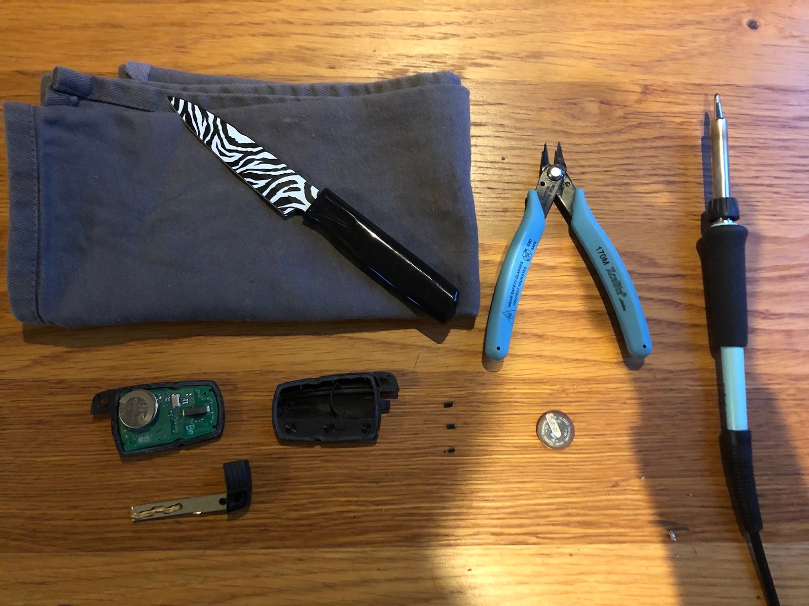

Op zoek naar een list voor de lege batterij van m'n autosleutel vond ik vele instructables met daarbij de klacht dat deze niet zonder breek- en soldeerwerk te vervangen is. Meestal met daarbij een beschuldiging van geldklopperij. Nieuwe sleutel is inderdaad niet gratis, maar een nieuwe auto aanmerkelijk duurder,

Na 14 jaar laadde bij mij ėėn van de autosleutels niet meer op (het is een accuutje); Ruim voorbij de gemiddelde levensduur van een auto. En 14 jaar is de batterij er níét door nieuwsgierige vingers uitgepeuterd. Prima dus !

Maar nu is hij op en ik wil daar wat aan doen. Als je een oester kan openmaken dan lukt dit. Ook hier doek gebruiken om [SEH](https://www.olvg.nl/afdelingen/spoedeisende-hulp/)bezoek te voorkomen. Youtube-willy-wortels raadden mij aan om [op ebay de versie](https://www.ebay.com/sch/i.html?_nkw=vl2020+panasonic+bmw) te bestellen met de pootjes op precies de goede plek. Dat deze alleen nog maar op ebay is te vinden komt omdat hij niet meer gemaakt wordt. Je bent dan met veel liefde en toewijding een stokoude batterij in je sleutel aan het knutselen. 

Ik kocht een [VL2020 met pootjes](https://nl.rs-online.com/web/p/button-rechargeable-batteries/6690514) die nog wel gemaakt wordt voor 6 euro en soldeerde er een draadje aan. 