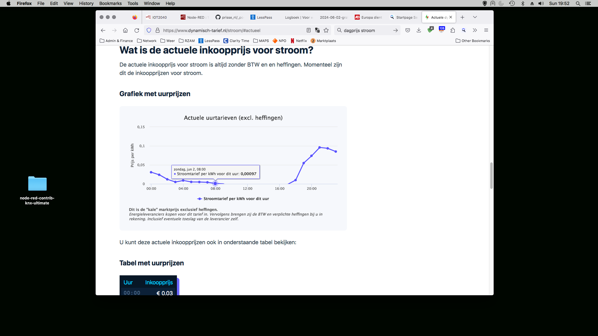

  

Het waait, de zon schijnt en het is Zondag: dan is in Nederland de stroom bijna gratis en gaat bij mij thuis van alles aan. Er wordt hier warmwater gemaakt, (af)gewassen en stofgezogen voor een habbekrats. Het ontbreekt in Europa aan normstelling om adaptief verbruik mogelijk te maken voor iedereen. Het komt erop neer dat alleen rijken (en technisch vernuftigen) de vruchten plukken van de verdere vermarkting van energieproductie en distributie. 

Het kost niets, eisen stellen aan nieuwbouw, witgoed en electronica. Maar dat moet dan wel in een ander tempo dan waarin normstelling voor telefoonladers gegaan is. Daar heeft Brussel 25 jaar over gedaan; toen ze daar mee begon was de markt nog verdeeld tussen Nokia, Ericsson en Motorola!
